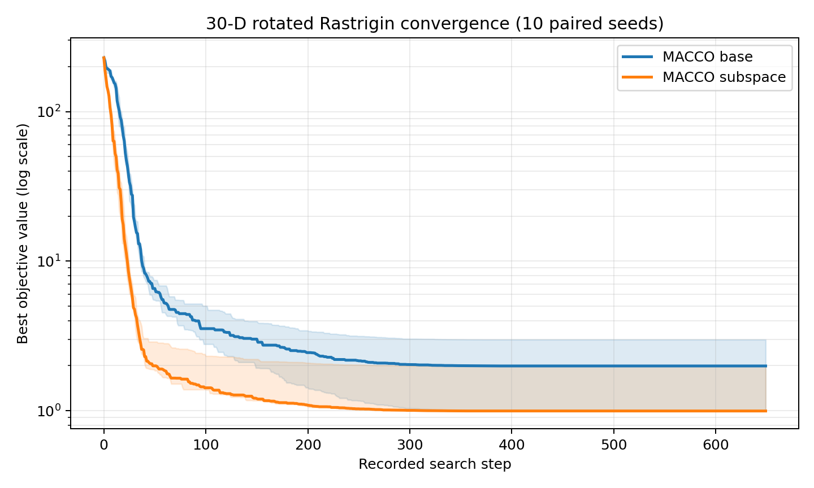

# MACCO-General

MACCO-General is a lightweight Python 3.10+ research optimizer for bounded continuous
black-box problems. It provides two user-facing algorithms:

- `minimize`: rank-weighted consensus search with differential scouts and
  diagonal anisotropic polishing.
- `minimize_subspace`: adds low-rank elite-direction learning for rotated or
  non-separable problems.

The project is reproducible, budget-aware, NumPy-only, and released under the
MIT License. It is an independent research project and not a claim of universal
superiority over established optimizers.

## Installation

Clone the repository and install it in editable mode:

```bash
git clone https://github.com/fangjianzhi/MACCO-General.git
cd MACCO-General
python -m pip install -e .
```

## Quick start

```python
import numpy as np
from macco import minimize_subspace

def rastrigin(x):
    return 10 * x.size + np.sum(x**2 - 10 * np.cos(2 * np.pi * x))

result = minimize_subspace(
    rastrigin,
    dim=30,
    lb=-5.12,
    ub=5.12,
    population_size=40,
    max_evaluations=20_000,
    seed=42,
)

print(result.best_f)
print(result.best_x)
print(result.evaluations)
```

Both optimizers return a `MACCOResult` containing `best_x`, `best_f`,
`history`, `evaluations`, `iterations`, `seed`, and `restarts`.

## Visual example

The reproducible example below compares the base and subspace variants on a
30-dimensional shifted and rotated Rastrigin problem. Lines show median
best-so-far values over 10 paired seeds; shaded regions show interquartile
ranges. It is a demonstration, not a universal performance claim.



Regenerate it locally with:

```bash
python -m pip install -e .[plot]
python examples/visualize_convergence.py
```

## Which optimizer should I use?

Use `minimize` as the conservative default for ordinary bounded continuous
problems. Use `minimize_subspace` when variables are coupled, the landscape is
rotated/non-separable, or a small number of joint directions may explain useful
search motion.

Known limitations include discrete/combinatorial variables, equality
constraints, very noisy objectives, deceptive remote optima, and severely
ill-conditioned problems where mature full-covariance methods may be better.

## Core mechanisms

1. Rank-weighted consensus development.
2. Differential mutation scouts for diversity.
3. Diagonal scale learning and anisotropic local polishing.
4. Optional thin-SVD elite subspace learning without a full `D x D` covariance
   matrix.

For population size `N`, dimension `D`, evaluation budget `B`, and subspace
rank `r`, the stored search state is `O(ND + rD)`. Objective evaluation cost is
problem dependent and usually dominates optimizer overhead.

## Reproducibility and tests

```bash
python -m unittest discover -s tests -v
python examples/quick_start.py
```

Benchmark runners are included for transparent experimentation:

```bash
python run_benchmarks.py --dim 30 --runs 20 --population 40 --budget 20000
python run_advanced.py --dimensions 30 --runs 20 --algorithms MACCO MACCO_LR
python run_classic23.py --runs 20 --algorithms MACCO MACCO_LR CMA_ES L_SHADE
```

The included CMA-ES and L-SHADE implementations are development baselines.
Publication-quality claims should be cross-checked against maintained or
author-official implementations.

## Project status

Version 0.3.0 is an alpha research release. Current evidence supports further
study of the subspace variant on rotated, coupled, and regularly multimodal
continuous problems. See [scope and limitations](docs/SCOPE.md).

## Contributing

Bug reports, reproducibility checks, benchmark corrections, and documentation
improvements are welcome. See [CONTRIBUTING.md](CONTRIBUTING.md).

## License

MIT License. See [LICENSE](LICENSE).
